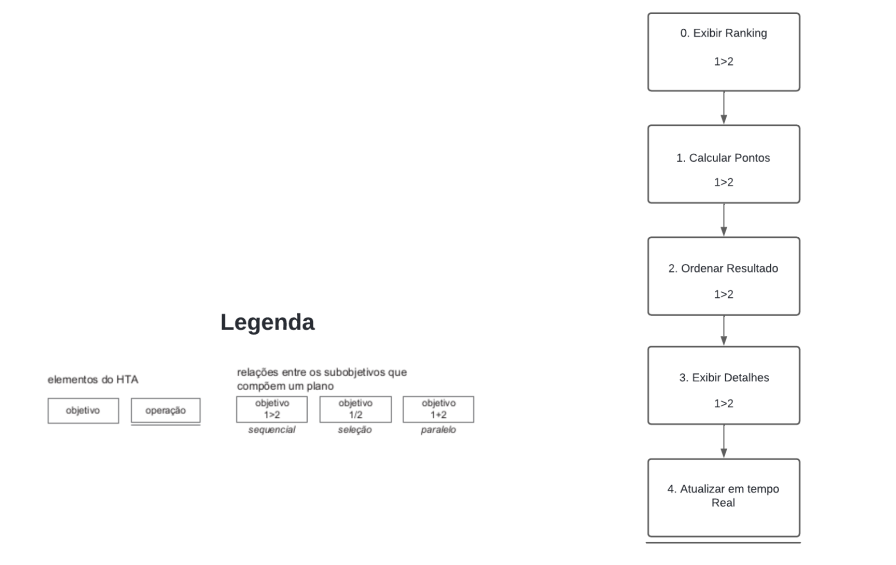

# Análise Hierárquica de Tarefas (HTA)

## <a>Introdução</a>

Segundo BARBOSA e SILVA(2021) a Análise Hierárquica de Tarefas (HTA) é um método desenvolvido na década de 1960, focado no entendimento das competências e habilidades em tarefas complexas e não repetitivas. A HTA inclui uma análise funcional de tarefas que começa com a definição dos objetivos das pessoas, considerando as ações através das quais a tarefa pode ser realizada para atingir esses objetivos. Para visualizar a análise, pode-se usar diagramas ou tabelas, detalhados na representação gráfica exemplificada na figura 1.

<figure markdown>

<b>Figura 1</b> - Notação diagrama HTA.

{width: 350}

Fonte: BARBOSA e SILVA, 2021, p.179.<a id=anchor_1 href="#REF1">1</a>

</figure>

## <a>Análise de Tarefas</a>

A figura x e a tabela y a seguir mostram o diagrama HTA e a tabela HTA desta tarefa. 
### <a>1. Submissão de Problema</a>

Nesta tarefa, o usuário tem o objetivo de submeter uma solução para um problema de programação. A figura 2 e a tabela 1 a seguir mostram o diagrama HTA e a tabela HTA desta tarefa. 

<figure markdown>
<b>Figura 2</b> - Diagrama HTA de Submissão de Problemas.

{width: 300}

Fonte: [João Artur](https://github.com/joao-artl).

</figure>

<b>Tabela 1</b> - Tabela HTA de Submissão de Problema

| Objetivos/Operações | Problemas e Recomendações |
|---------------------|---------------------------|
| **0. Submeter solução** | |
| **1. Selecionar problema** | **Input:** Usuário escolhe o problema a partir da lista. **Feedback:** Detalhes do problema são exibidos. |
| **2. Escrever código** | **Input:** Usuário escreve solução no editor integrado. **Feedback:** Realce de sintaxe e erros de compilação em tempo real. |
| **3. Testar código** | **Input:** Usuário executa testes locais. **Feedback:** Resultados dos testes exibidos. |
| **4. Submeter solução** | **Input:** Usuário clica em 'Submeter'. **Feedback:** Solução é enviada para avaliação. |
| **5. Receber feedback** | **Feedback:** Resultados da avaliação (correto, erro de execução, tempo excedido, etc.). |

Fonte: [João Artur](https://github.com/joao-artl).

### <a>2. Tutorial de Resolução de Questões Pós-Contest</a>

Nesta tarefa, o usuário ou administrador fornece um passo a passo detalhado das soluções para os problemas apresentados após o fim de um contest. Esta atividade é essencial para o aprendizado e aprimoramento das habilidades de programação dos participantes. A figura 3 e a tabela 2 a seguir mostram o diagrama HTA e a tabela HTA desta tarefa. 

<figure markdown>
<b>Figura 3</b> - Diagrama HTA de Tutorial de Resolução de Questões Pós-Contestt.

{width: 300}

Fonte: [João Artur](https://github.com/joao-artl).

</figure>

<b>Tabela 2</b> - Tabela HTA de Tutorial de Resolução de Questões Pós-Contest

| Objetivos/Operações | Problemas e Recomendações |
|---------------------|---------------------------|
| **0. Acessar soluções pós-contest** | |
| **1. Selecionar o contest encerrado** | **Input:** Usuário acessa a lista de contests encerrados. **Feedback:** Lista de contests com seus respectivos problemas e soluções disponíveis é exibida. |
| **2. Escolher problema para revisar** | **Input:** Usuário escolhe um problema específico para aprender a solução. **Feedback:** Detalhes do problema e soluções passo a passo são disponibilizados. |
| **3. Estudar a solução** | **Feedback:** Usuário segue o tutorial que explica cada parte da solução, incluindo as técnicas utilizadas, lógica de programação e otimizações possíveis. |
| **4. Acessar discussões e comentários** | **Input:** Usuário pode participar de fóruns ou seções de comentários para discutir a solução e tirar dúvidas. **Feedback:** Comunicação com outros usuários para aprofundamento do entendimento. |

Fonte: [João Artur](https://github.com/joao-artl).

### <a>3. Verificação de Submissões</a>

Nesta tarefa, o usuário ou o administrador verifica o resultado das submissões feitas durante um contest. A figura 4 e a tabela 3 a seguir mostram o diagrama HTA e a tabela HTA desta tarefa. 

<figure markdown>
<b>Figura 4</b> - Diagrama HTA de Verificação de Submissões.

{width: 300}

Fonte: [João Artur](https://github.com/joao-artl).

</figure>

<b>Tabela 3</b> - Tabela HTA de Verificação de Submissões

| Objetivos/Operações | Problemas e Recomendações |
|---------------------|---------------------------|
| **0. Verificar submissões** | |
| **1. Acessar lista de submissões** | **Input:** Usuário ou administrador acessa a lista de submissões do contest. **Feedback:** Lista de submissões exibida. |
| **2. Analisar resultado** | **Input:** Seleção de uma submissão específica. **Feedback:** Detalhes do resultado da submissão (correto, erro, tempo excedido, etc.). |
| **3. Verificar logs de execução** | **Input:** Acesso aos logs de execução para detalhamento de erros. **Feedback:** Logs exibidos para diagnóstico. |

Fonte: [João Artur](https://github.com/joao-artl).

### <a>4. Ranking de Contest</a>

Esta tarefa aborda como os resultados dos participantes são calculados e exibidos em forma de ranking durante ou após um contest. A figura 5 e a tabela 4 a seguir mostram o diagrama HTA e a tabela HTA desta tarefa. 

<figure markdown>
<b>Figura 5</b> - Diagrama HTA de Ranking de Contest.

{width: 300}

Fonte: [João Artur](https://github.com/joao-artl).

</figure>

<b>Tabela 4</b> - Tabela HTA de Ranking de Contest

| Objetivos/Operações | Problemas e Recomendações |
|---------------------|---------------------------|
| **0. Exibir ranking** | |
| **1. Calcular pontos** | **Input:** Sistema processa os resultados das submissões. **Feedback:** Pontuação calculada com base em critérios predefinidos. |
| **2. Ordenar resultados** | **Input:** Sistema ordena participantes com base na pontuação e outros critérios. **Feedback:** Ranking atualizado e exibido. |
| **3. Exibir detalhes** | **Input:** Usuário acessa detalhes de performance individual e comparações. **Feedback:** Detalhes exibidos incluem tempo de submissão, número de tentativas, etc. |
| **4. Atualizar ranking em tempo real** | **Input:** Sistema atualiza o ranking conforme novas submissões são processadas. **Feedback:** Ranking dinâmico e sempre atualizado. |

Fonte: [João Artur](https://github.com/joao-artl).

### <a>5. Criação de Problema (Administrador)</a>

Nesta tarefa, o administrador cria e configura novos problemas para os usuários resolverem. A figura 6 e a tabela 5 a seguir mostram o diagrama HTA e a tabela HTA desta tarefa. 

<figure markdown>
<b>Figura 6</b> - Diagrama HTA de Criação de Problema.

{width: 300}

Fonte: [João Artur](https://github.com/joao-artl).

</figure>

<b>Tabela 5</b> - Tabela HTA de Criação de Problema

| Objetivos/Operações | Problemas e Recomendações |
|---------------------|---------------------------|
| **0. Criar problema** | |
| **1. Definir enunciado** | **Input:** Administrador escreve o enunciado. **Feedback:** Pré-visualização do texto. |
| **2. Configurar testes** | **Input:** Entradas e saídas esperadas são definidas. **Feedback:** Testes salvos para validação. |
| **3. Definir restrições** | **Input:** Limites de tempo e memória. **Feedback:** Restrições registradas no sistema. |
| **4. Publicar problema** | **Input:** Clique em 'Publicar'. **Feedback:** Problema disponível para usuários. |

Fonte: [João Artur](https://github.com/joao-artl).

### <a>6. Criação de Contest (Administrador)</a>

Nesta tarefa, o administrador organiza competições (contests) que agregam diversos problemas para serem resolvidos pelos participantes dentro de um tempo definido. A figura 7 e a tabela 6 a seguir mostram o diagrama HTA e a tabela HTA desta tarefa. 

<figure markdown>
<b>Figura 7</b> - Diagrama HTA de Criação de Contest.

{width: 300}

Fonte: [João Artur](https://github.com/joao-artl).

<b>Tabela 6</b> - Tabela HTA de Criação de Contest

| Objetivos/Operações | Problemas e Recomendações |
|---------------------|---------------------------|
| **0. Criar contest** | |
| **1. Definir informações básicas** | **Input:** Nome, duração e tipo de acesso (público ou privado). **Feedback:** Informações registradas. |
| **2. Selecionar problemas** | **Input:** Escolher problemas da biblioteca ou criar novos. **Feedback:** Problemas adicionados ao contest. |
| **3. Configurar participantes** | **Input:** Definir se o contest é aberto a todos ou apenas por convite. **Feedback:** Configuração salva. |
| **4. Definir regras de pontuação** | **Input:** Estabelecer critérios de pontuação e penalidades. **Feedback:** Regras estabelecidas para o contest. |
| **5. Publicar contest** | **Input:** Clique em 'Publicar'. **Feedback:** Contest disponível para inscrição ou participação direta. |

Fonte: [João Artur](https://github.com/joao-artl).

## <a>Referências Bibliográficas</a>

> <a id="REF1" href="#anchor_1">1.</a> Barbosa, S. D. J.; Silva, B. S. da; Silveira, M. S.; Gasparini, I.; Darin, T.; Barbosa, G. D. J. (2021) *Interação Humano-Computador e Experiência do usuário.* Capítulo 8 Organização do Espaço de Problema, tópico 8.4.1 Análise Hierárquica de Tarefas, página 178 à 181 . Autopublicação. ISBN: 978-65-00-19677-1.

## <a>Histórico de Versão</a>

| Versão| Data | Data Prevista de Revisão| Descrição  | Autor(es)  | Revisor(es) |
| ------- | ------ | ------ | ------- | -------- | -------- |
| `1.0` | 13/04/2024 | 20/04/2024 | Criação da página de Análise Hierárquica de Tarefas.| [João Artur](https://github.com/joao-artl)|[Diego Sousa](https://github.com/DiegoSousaLeite)|
| `1.1` | 21/04/2024 | 23/04/2024 | Adicionando imagem dos diagramas.| [João Artur](https://github.com/joao-artl)|[Diego Sousa](https://github.com/DiegoSousaLeite)|
| `1.2` | 19/05/2024 | 20/05/2024 | Corrigindo diagramas e referências.| [João Artur](https://github.com/joao-artl)|[Diego Sousa](https://github.com/DiegoSousaLeite)|
