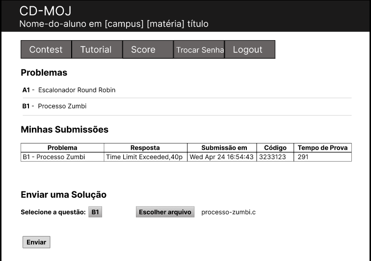

# Relato dos Resultados

## <a>Introdução</a>

Segundo Barbosa e Silva (2021)<a id="anchor_1" href="#REF1">^1^</a>, o relato de resultados da avaliação serve para registrar de maneira sistemática e detalhada as descobertas feitas durante o processo avaliativo. Este documento fornece informações sobre a interação dos usuários com o sistema, permitindo avaliar a qualidade do uso da solução e identificar problemas na interação e na interface que possam prejudicar a experiência do usuário. O documento em questão apresenta os resultados obtidos durante as avaliações da Análise de Tarefas.

## <a>Relato - Verificação de Submissão</a>

### <a>Objetivos e Escopo da Avaliação</a>

A avaliação teve como objetivo validar se a tarefa de Verificação de Submissão está de acordo com o fluxo de atividades do CD-MOJ e identificar áreas de melhoria para fornecer um suporte mais eficaz aos usuários.

### <a>Método de Avaliação Empregado</a>
O método de avaliação foi uma combinação de observação e entrevistas com o usuário, conforme o framework DECIDE<a id="anchor_2" href="#REF2">^2^</a>. Nela foi pedido que o usuário explicasse o fluxo necessário para realizar a tarefa e após isso ele foi perguntado sobre algumas questões. A tabela 1 apresenta as informações sobre a entrevista:

<b>Tabela 1</b> - Entrevista Verificação de Submissões.

| Entrevistador(es) | Entrevistado(s) | Horário | Duração  | Data    |    Local     |
| :----------------: | :-------------: | :---------------: | :------------: | :--------: | :----------: |
|  [João Artur](https://github.com/joao-artl)  |   Júlio    |  22:00 | 15 minutos | 30/05/2023 | Microsoft Teams |

Fonte: [João Artur](https://github.com/joao-artl).

### <a>Número e Perfil dos Usuários e Avaliadores</a>

O participante se encaixa no [perfil de usuário](https://interacao-humano-computador.github.io/2024.1-CD-MOJ/analise-de-requisitos/perfildeUsuario/), ele é um usuário de entre 18 e 30 anos, estudante de ensino superior e usuário frequente do CD-MOJ.

### <a>Sumário dos Dados Coletados</a>

Durante a entrevista foram coletados dados sobre, a interação do usuário com o sistema realizada atráves da execução da tarefa, feedbacks sobre o [diagrama HTA](https://interacao-humano-computador.github.io/2024.1-CD-MOJ/analise-de-requisitos/analise-de-tarefas/analiseHierarquicaTarefa/#3-verificacao-de-submissoes) e as respostas das perguntas presentes no [planejamento da avaliação](https://interacao-humano-computador.github.io/2024.1-CD-MOJ/design-avaliacao-desenvolvimento/nivel1/analiseTarefas/planejamentoAvaliacao/).

### <a> Análise dos dados coletados </a>

A partir da entrevista realizada e da observação do usuário, pode-se concluir que a tarefa está de acordo com o diagrama de Verificação de Submissões. O usuário relatou que a falta de informações claras no log é um problema, uma vez que dificulta a correção das questões. Segundo ele existe uma ferramenta que é capaz de auxiliar nisso, mas ela seria bem mais atrativa se estivesse presente no site do CD-MOJ.

### <a> Sugestões de melhoria </a>

O usuário relatou duas melhorias que segundo ele seriam fundamentais para o site:

- Melhoria na responsividade do site, principalmente para dispositivos móveis.

- Adicionar a ferramenta de visualização de log no site, atualmente ela só está disponível através de um bot no Telegram.

### <a>Gravação da Entevista</a>

<iframe width="853" height="480" src="https://www.youtube.com/embed/WKScpNRTWAo?si=8d1ZoV2LW9JVQZ1i" title="Relato - Verificação de Submissão" frameborder="0" allow="accelerometer; autoplay; clipboard-write; encrypted-media; gyroscope; picture-in-picture; web-share" referrerpolicy="strict-origin-when-cross-origin" allowfullscreen></iframe>

## <a>Relato - Criação de Contest</a>

### <a>Objetivos e Escopo da Avaliação</a>

A avaliação teve como objetivo validar se a tarefa de Criação de contest está de acordo com o fluxo de atividades do CD-MOJ e identificar áreas de melhoria para fornecer um suporte mais eficaz aos usuários.

### <a>Método de Avaliação Empregado</a>
O método de avaliação foi uma combinação de observação e entrevistas com o usuário, conforme o framework DECIDE<a id="anchor_2" href="#REF2">^2^</a>. Nela foi pedido que o usuário explicasse o fluxo necessário para realizar a tarefa e após isso ele foi perguntado sobre algumas questões. A tabela 2 apresenta as informações sobre a entrevista:

<figure markdown>
<b>Tabela 2</b> - Entrevista Criação de Contest.

| Entrevistador(es) | Entrevistado(s) | Horário | Duração  | Data    |    Local     |
| :----------------: | :-------------: | :---------------: | :------------: | :--------: | :----------: |
|  [Douglas Marinho](https://github.com/M4RINH0)  |   Ana Júlia    |  16:00 | 15 minutos | 03/06/2023 | Microsoft Teams |

Fonte: [Douglas Marinho](https://github.com/M4RINH0).

### <a>Número e Perfil dos Usuários e Avaliadores</a>

O participante se encaixa em um dos [perfis de usuário](https://interacao-humano-computador.github.io/2024.1-CD-MOJ/analise-de-requisitos/perfildeUsuario/), ele é um usuário de entre 18 e 30 anos, estudante de ensino superior e usuário raro do CD-MOJ.

### <a>Sumário dos Dados Coletados</a>

Durante a entrevista foram coletados dados sobre, a interação do usuário com o sistema realizada atráves da execução da tarefa, feedbacks sobre o [diagrama HTA](https://interacao-humano-computador.github.io/2024.1-CD-MOJ/analise-de-requisitos/analise-de-tarefas/analiseHierarquicaTarefa/#3-verificacao-de-submissoes) e as respostas das perguntas presentes no [planejamento da avaliação](https://interacao-humano-computador.github.io/2024.1-CD-MOJ/design-avaliacao-desenvolvimento/nivel1/analiseTarefas/planejamentoAvaliacao/).

### <a> Análise dos dados coletados </a>

A partir da entrevista realizada e da observação do usuário, pode-se concluir que a tarefa está de acordo com o diagrama de Verificação de Submissões. O usuário relatou que a tela minimalista auxilia em não tirar atenção do usuário mas não o chama atenção para continuar o uso, e o metodo de criação aparenta ser obsoleto.

### <a> Sugestões de melhoria </a>

O usuário relatou uma melhoria que segundo ele seriam fundamentais para o site:

- Melhoria na interface geral do site, pois sentiu incômodo na mistura do inglês com português.

### <a>Gravação da Entevista</a>

<iframe width="853" height="480" src="https://www.youtube.com/embed/BFRRn7AmvJY?si=sJdTlhDjJU2MaFIj" title="YouTube video player" frameborder="0" allow="accelerometer; autoplay; clipboard-write; encrypted-media; gyroscope; picture-in-picture; web-share" referrerpolicy="strict-origin-when-cross-origin" allowfullscreen></iframe>

## <a>Tutorial de Resolução de Questões Pós-Contest</a>

### <a>Objetivos e Escopo da Avaliação</a>
A avaliação teve como objetivo validar a tarefa de <a>Tutorial de Resolução de Questões Pós-Contest</a>, que é uma tarefa ainda não implementada no CD-MOJ, está de acordo com um fluxo padrão de atividades da plataforma, além de identificar áreas de melhoria para que esta funcionalidade, quando implementada, possa fornecer com êxito todas as expectativas do usuário em relação a funcionalidade.

### <a>Método de Avaliação Empregado</a>
O método de avaliação foi uma combinação de observação e entrevistas com o usuário, conforme o framework DECIDE<a id="anchor_2" href="#REF2">^2^</a>. Por se tratar de uma funcionalidade não existente no CD-MOJ, foi feito uma prototipação usando a ferramenta Figma, para que o entrevistado conseguisse simular o uso da funcionalidade. No protótipo foi pedido que a usuária explicasse o fluxo necessário para realizar a tarefa e após isso foram feitas perguntas sobre algumas questões. A tabela 3 apresenta as informações sobre a entrevista:

<b>Tabela 3</b> - Cronograma da Entrevista

| Entrevistador(es) | Entrevistado(s) | Horário | Duração  | Data    |    Local     |
| :----------------: | :-------------: | :---------------: | :------------: | :--------: | :----------: |
|  [Arthur Alves](https://github.com/arthrok)  |   Maria Eduarda    |  15:00 | 15 minutos | 03/06/2023 | Teams |

<b>Fonte:</b> [Arthur Alves](https://github.com/arthrok)

Veja nas figuras a seguir, as telas feitas para que o usuário testasse a funcionalidade proposta para o CD-MOJ. É possível testar o protótipo de forma interativa e navegável clicando no link [https://www.figma.com/proto/FuZ6K2PYn8CPTjrz47tF8U/CD-MOJ---Tutorial?node-id=2-58&viewport=542%2C227%2C0.25&t=kRQfryIIJMoHiqJE-1&scaling=min-zoom&page-id=0%3A1&starting-point-node-id=2%3A58](https://www.figma.com/proto/FuZ6K2PYn8CPTjrz47tF8U/CD-MOJ---Tutorial?node-id=2-58&viewport=542%2C227%2C0.25&t=kRQfryIIJMoHiqJE-1&scaling=min-zoom&page-id=0%3A1&starting-point-node-id=2%3A58)

A figura 1 representa a tela inicial do contest, nela foi adicionado um botão "Tutorial" para que o usuário possa usar como referência para obter ajuda por meio do tutorial no contest.

<b>Figura 1</b> - Tela inicial do contest.

    <figure markdown>
    {width: 300}
    </figure>

<b>Fonte:</b> [Arthur Alves](https://github.com/arthrok)

Na figura 2 é possível que o usuário selecione um problema específico do contest para que ele possa conferir a solução.

<b>Figura 2</b> - Selecionar problema para ver tutorial.

    <figure markdown>
    {width: 300}
    </figure>

<b>Fonte:</b> [Arthur Alves](https://github.com/arthrok)

Na figura 3, o usuário consegue ver a solução para o problema do contest.

<b>Figura 3</b> - Apresentação da solução.

    <figure markdown>
    {width: 300}
    </figure>

<b>Fonte:</b> [Arthur Alves](https://github.com/arthrok)

### <a>Número e Perfil dos Usuários e Avaliadores</a>
A entrevista foi feita com um usuário. A participante se encaixa no [perfil de usuário](https://interacao-humano-computador.github.io/2024.1-CD-MOJ/analise-de-requisitos/perfildeUsuario/), ela é uma usuário de 21 anos, cursando ensino superior em Engenharia de Software e usa frequentemente o CD-MOJ.

### <a>Sumário dos Dados Coletados</a>
Durante a entrevista foram coletados dados sobre, a interação do usuário com o sistema realizada atráves da execução da tarefa, feedbacks sobre o [diagrama HTA](https://interacao-humano-computador.github.io/2024.1-CD-MOJ/analise-de-requisitos/analise-de-tarefas/analiseHierarquicaTarefa/#2-tutorial-de-resolucao-de-questoes-pos-contest) e as respostas das perguntas presentes no [planejamento da avaliação](https://interacao-humano-computador.github.io/2024.1-CD-MOJ/design-avaliacao-desenvolvimento/nivel1/analiseTarefas/planejamentoAvaliacao/).

### <a>Análise dos Dados Coletados</a>
A usuária relatou que todas as informações apresentadas na tarefa são relevantes. Ela não encontrou partes da tarefa que causaram confusão ou foram interpretadas de maneira errada. Além disso, ela conseguiu relacionar as situações da tarefa com suas experiências anteriores, indicando que a tarefa transmite efetivamente a urgência e importância das informações ou ações descritas.

De modo geral, a usuária achou que a tarefa atende aos objetivos e necessidades dos usuários, e considerou a funcionalidade de tutoriais pós-contest uma ótima ideia para facilitar o aprendizado e aprimoramento das habilidades de programação. A implementação das sugestões fornecidas pode contribuir significativamente para melhorar a experiência dos usuários e a eficácia do sistema CD-MOJ.

### <a>Sugestões de Melhoria</a>
A usuária relatou dois pontos de melhoria que seriam fundamentais para uma melhor experiência na plataforma:

- Jargões como "contest" não são adequados para iniciantes, ela sugere trocar o termo para algo similar. 

### <a>Gravação da Entrevista</a>

<iframe width="853" height="480" src="https://www.youtube.com/embed/2LhQcF9Vx9Q" title="Entrevista HTA: Tutorial de Resolução de Questões Pós-Contest - Nível 1 - Grupo 01 (CD-MOJ)" frameborder="0" allow="accelerometer; autoplay; clipboard-write; encrypted-media; gyroscope; picture-in-picture; web-share" referrerpolicy="strict-origin-when-cross-origin" allowfullscreen></iframe>

## <a>Submissão de Problemas</a>

### <a>Objetivos e Escopo da Avaliação</a>
A avaliação teve como objetivo validar a tarefa de <a href="https://interacao-humano-computador.github.io/2024.1-CD-MOJ/analise-de-requisitos/analise-de-tarefas/analiseHierarquicaTarefa/#1-submissao-de-problema">Submissão de Problemas</a>, uma tarefa já implementada no CD-MOJ, na qual foi verificado se o fluxo padrão de atividades da plataforma está de acordo com o diagrama e com a descrição da tarefa, além de identificar áreas de melhoria para que essa funcionalidade, possa corresponder com êxito a todas as expectativas do usuário.

### <a>Método de Avaliação Empregado</a>
O método de avaliação foi uma combinação de observação e entrevistas com o usuário, conforme o framework DECIDE<a id="anchor_2" href="#REF2">^2^</a>. Primeiro foi verificado se o entrevistado correspondia ao perfil dos usuários da plataforma do CD-MOJ, para uma melhor expericência e domínio sobre o sistema. Após essa verificação, houve a apresentação do diagrama e a verificação se o diagrama e sua descrição estão de acordo com a expectativa do usuário e fiel ao já implementado, verificando item por item se o usuário estava de acordo com aquela especificação. Na Tabela 4 apresenta as informações sobre a entrevista:

<b>Tabela 4</b> - Cronograma da Entrevista - Submissão de Problemas

| Entrevistador(es) | Entrevistado(s) | Horário | Duração  | Data    |    Local     |
| :----------------: | :-------------: | :---------------: | :------------: | :--------: | :----------: |
|  [Eric Silveira](https://github.com/ericbky)  |   William Bernardo    |  10:20 | 15 minutos | 03/06/2023 | Laboratório ITRAC |

<b>Fonte:</b> [Eric Silveira](https://github.com/ericbky)

### <a>Número e Perfil dos Usuários e Avaliadores</a>
A entrevista foi feita com um usuário. O participante se encaixa no [perfil de usuário](https://interacao-humano-computador.github.io/2024.1-CD-MOJ/analise-de-requisitos/perfildeUsuario/), ele é uma usuário de 21 anos, cursando ensino superior em Engenharia de Software e usa frequentemente o CD-MOJ.

### <a>Sumário dos Dados Coletados</a>
Durante a entrevista foram coletados dados sobre, a interação do usuário com o sistema realizada atráves da execução da tarefa, feedbacks sobre o [diagrama HTA](https://interacao-humano-computador.github.io/2024.1-CD-MOJ/analise-de-requisitos/analise-de-tarefas/analiseHierarquicaTarefa/#2-tutorial-de-resolucao-de-questoes-pos-contest) e as respostas das perguntas presentes no [planejamento da avaliação](https://interacao-humano-computador.github.io/2024.1-CD-MOJ/design-avaliacao-desenvolvimento/nivel1/analiseTarefas/planejamentoAvaliacao/).

### <a>Análise dos Dados Coletados

### <a>Sugestões de Melhoria</a>
O usuário afirmou que o CD-MOJ tem muito a melhorar sobre diversos aspectos, porém afirmou que essa análise de tarefas está bem descrita e que para o seu propósito, é uma solução e tarefa eficiente. 

### <a>Gravação da Entrevista</a>

<iframe width="853" height="480" src="https://www.youtube.com/embed/njQon_StAZg?si=-20kIX8IhuI-mZNS" title="Análise HTA - Eric Silveira" frameborder="0" allow="accelerometer; autoplay; clipboard-write; encrypted-media; gyroscope; picture-in-picture; web-share" referrerpolicy="strict-origin-when-cross-origin" allowfullscreen></iframe>

## <a>Ranking de Contest</a>

### <a>Objetivos e Escopo da Avaliação</a>
A avaliação teve como objetivo validar a tarefa de <a href="https://interacao-humano-computador.github.io/2024.1-CD-MOJ/analise-de-requisitos/analise-de-tarefas/analiseHierarquicaTarefa/#4-ranking-de-contest">Ranking de Contest</a>, uma tarefa já implementada no CD-MOJ, na qual foi verificado se o fluxo padrão de atividades da plataforma está de acordo com o diagrama e com a descrição da tarefa, além de identificar áreas de melhoria para que essa funcionalidade possa corresponder com êxito a todas as expectativas do usuário.

### <a>Método de Avaliação Empregado</a>
O método de avaliação foi uma combinação de observação e entrevistas com o usuário, conforme o framework DECIDE<a id="anchor_2" href="#REF2">^2^</a>. Primeiro foi verificado se o entrevistado correspondia ao perfil dos usuários da plataforma do CD-MOJ, para uma melhor experiência e domínio sobre o sistema. Após essa verificação, houve a apresentação do diagrama e a verificação se o diagrama e sua descrição estão de acordo com a expectativa do usuário e fiel ao já implementado, verificando item por item se o usuário estava de acordo com aquela especificação. A Tabela 5 apresenta as informações sobre a entrevista:

<b>Tabela 5</b> - Cronograma da Entrevista - Ranking de Contest

| Entrevistador(es) | Entrevistado(s) | Horário | Duração  | Data    |    Local     |
| :----------------: | :-------------: | :---------------: | :------------: | :--------: | :----------: |
|  [Diego Sousa](https://github.com/DiegoSousaLeite)  |   Iago Passaglia   |  19:00 | 8 minutos | 03/06/2023 | Teams |

<b>Fonte:</b> [Diego Sousa](https://github.com/DiegoSousaLeite)

### <a>Número e Perfil dos Usuários e Avaliadores</a>
A entrevista foi feita com um usuário. O participante se encaixa no [perfil de usuário](https://interacao-humano-computador.github.io/2024.1-CD-MOJ/analise-de-requisitos/perfildeUsuario/), ele é um usuário de entre 18 e 30 anos, estudante de ensino superior e usuário regular do CD-MOJ.

### <a>Sumário dos Dados Coletados</a>
Durante a entrevista, foram coletados dados sobre a interação do usuário com o sistema, feedbacks sobre o [diagrama HTA](https://interacao-humano-computador.github.io/2024.1-CD-MOJ/analise-de-requisitos/analise-de-tarefas/analiseHierarquicaTarefa/#4-ranking-de-contest) e as respostas às perguntas presentes no [planejamento da avaliação](https://interacao-humano-computador.github.io/2024.1-CD-MOJ/design-avaliacao-desenvolvimento/nivel1/analiseTarefas/planejamentoAvaliacao/).

### <a>Análise dos Dados Coletados</a>
O usuário afirmou que o CD-MOJ tem muito a melhorar sobre diversos aspectos e propôs algumas melhorias no diagrama de análise de tarefas. As sugestões foram:
- Os itens listados como objetivos talvez deveriam ser ações dentro do CD-MOJ, segundo as palavras do Iago.

### <a>Gravação da Entrevista</a>

<iframe width="1220" height="686" src="https://www.youtube.com/embed/5EHP3bsA_uw" title="HTA - Diego Sousa" frameborder="0" allow="accelerometer; autoplay; clipboard-write; encrypted-media; gyroscope; picture-in-picture; web-share" referrerpolicy="strict-origin-when-cross-origin" allowfullscreen></iframe>

## <a>Relato - Criação de Problema</a>

### <a>Objetivos e Escopo da Avaliação</a>

A avaliação teve como objetivo validar se o [Diagrama HTA de Criação de Problema (Administrador)](https://interacao-humano-computador.github.io/2024.1-CD-MOJ/analise-de-requisitos/analise-de-tarefas/analiseHierarquicaTarefa/#5-criacao-de-problema-administrador) está de acordo com o fluxo de atividades do CD-MOJ e identificar áreas de melhoria para fornecer um suporte mais eficaz aos usuários, especialmente aos que tem acesso a área de criação de problemas (admins). 

### <a>Método de Avaliação Empregado</a>

O método de avaliação foi uma combinação de observação e entrevistas com o usuário, conforme o framework DECIDE<a id="anchor_2" href="#REF2">^2^</a>. Inicialmente, o entrevistado fez a leitura e interpretação do Diagrama HTA de Criação de Problema. Posteriormente, ele foi questionado sobre algumas questões, e foi-lhe apresentado a parte textual do Diagrama. A tabela 6 apresenta as informações sobre a entrevista:

<b>Tabela 6</b> - Cronograma da Entrevista - Criação de Problema

| Entrevistador(es) | Entrevistado(s) | Horário | Duração | Data | Local |
| :----------------: | :-------------: | :---------------: | :------------: | :--------: | :----------: |
| [Luiz Gustavo](https://gith3ub.com/LuizGust4vo) | Pedro Lucas | 15:45 | 6 minutos | 04/06/2023 | Casa do entrevistador e entrevistado |

<b>Fonte:</b> [Luiz Gustavo](https://gith3ub.com/LuizGust4vo) 

### <a>Número e Perfil dos Usuários e Avaliadores</a>
O participante se encaixa no [perfil de usuário](https://interacao-humano-computador.github.io/2024.1-CD-MOJ/analise-de-requisitos/perfildeUsuario/), ele é um usuário de 22 anos, estudante de ensino superior (Engenharia de Software) e usuário frequente de juízes onlines e do CD-MOJ.

### <a>Sumário dos Dados Coletados</a>

Durante a entrevista foram coletados feedbacks sobre o diagrama, as respostas de algumas perguntas presentes no [planejamento da avaliação - Tabela 3 - Sugestão para roteiro de perguntas da entrevista durante avaliação](https://interacao-humano-computador.github.io/2024.1-CD-MOJ/design-avaliacao-desenvolvimento/nivel1/analiseTarefas/planejamentoAvaliacao/#prazos), e, se a parte textual do diagrama estava condizente com a parte ilustrativa.

### <a>Análise dos Dados Coletados

Com base na entrevista e na observação do usuário, pode-se concluir que o diagrama da tarefa de Criação de Problema está em conformidade com a realidade dos professores/monitores (administradores no geral) que utilizam o CD-MOJ.

### <a>Sugestões de Melhoria</a>

O usuário afirmou que o CD-MOJ tem muito a melhorar sobre diversos aspectos e propôs algumas melhorias de usabilidade:

- Interface muito fraca, simples, especialmente os botões (muito pequenos) e uma paleta de cores limitada;

- Falta de opção de pesquisa ou filtro para os contests (pesquisar ou filtrar por matéria, por exemplo);

- Lentidão na resposta da página, ela não atualiza automaticamente, então é necessário ficar recarregando (F5) para atualizar a página e obter a resposta. 

### <a>Gravação da Entrevista</a>

<iframe width="853" height="480" src="https://www.youtube.com/embed/Pq6IhB_Tgrg?si=HA5Gyje4HzlJ-GVu" title="YouTube video player" frameborder="0" allow="accelerometer; autoplay; clipboard-write; encrypted-media; gyroscope; picture-in-picture; web-share" referrerpolicy="strict-origin-when-cross-origin" allowfullscreen></iframe>

## <a>Referências Bibliográficas</a>

> <a id="REF1" href="#anchor_1">1.</a> Barbosa, S. D. J.; Silva, B. S. da; Silveira, M. S.; Gasparini, I.; Darin, T.; Barbosa, G. D. J. (2021) *Interação Humano-Computador e Experiência do usuário.* Capítulo 11 Planejamento da Avaliação de IHC, tópico 11.7.5 Consolidação e Relato dos Resultados, página 279 . Autopublicação. ISBN: 978-65-00-19677-1.

> <a id="REF2" href="#anchor_2">2.</a> Barbosa, S. D. J.; Silva, B. S. da; Silveira, M. S.; Gasparini, I.; Darin, T.; Barbosa, G. D. J. (2021) *Interação Humano-Computador e Experiência do usuário.* Capítulo 11 Planejamento da Avaliação de IHC, tópico 11.8 O Framework DECIDE, página 279 e 280. Autopublicação. ISBN: 978-65-00-19677-1.

## <a>Histórico de Versão</a>

| Versão| Data | Data Prevista de Revisão| Descrição  | Autor(es)  | Revisor(es) |
| ------- | ------ | ------ | ------- | -------- | -------- |
| `1.0` | 31/05/2024 | 01/06/2024 | Criação do documento e relato da verificação de submissões| [João Artur](https://github.com/joao-artl)|[Diego Sousa](https://github.com/DiegoSousaLeite)|
| `1.1` | 31/05/2024 | 01/06/2024 | Adicionando vídeo da entrevista| [João Artur](https://github.com/joao-artl)|[Diego Sousa](https://github.com/DiegoSousaLeite)|
| `1.2` | 03/06/2024 | 03/06/2024 | Relato da Criação de Contest| [Douglas Marinho](https://github.com/M4RINH0)|[Diego Sousa](https://github.com/DiegoSousaLeite)|
| `1.3` | 03/06/2024 | 03/06/2024 | Relato do Tutorial pós-contest| [Arthur Alves](https://github.com/Arthrok)|[Diego Sousa](https://github.com/DiegoSousaLeite)|
| `1.4` | 03/06/2024 | 03/06/2024 | Relato da Submissão de Problemas| [Eric Silveira](https://github.com/ericbky)|[Diego Sousa](https://github.com/DiegoSousaLeite)|
| `1.4` | 03/06/2024 | 03/06/2024 | Relato da Submissão de Problemas| [Diego Sousa](https://github.com/DiegoSousaLeite)|[João Artur](https://github.com/joao-artl)|
| `1.5` | 04/06/2024 | 05/06/2024 | Relato da Criação de Problema e correção das tabelas| [Luiz Gustavo](https://gith3ub.com/LuizGust4vo) | [Eric Silveira](https://github.com/ericbky) |
