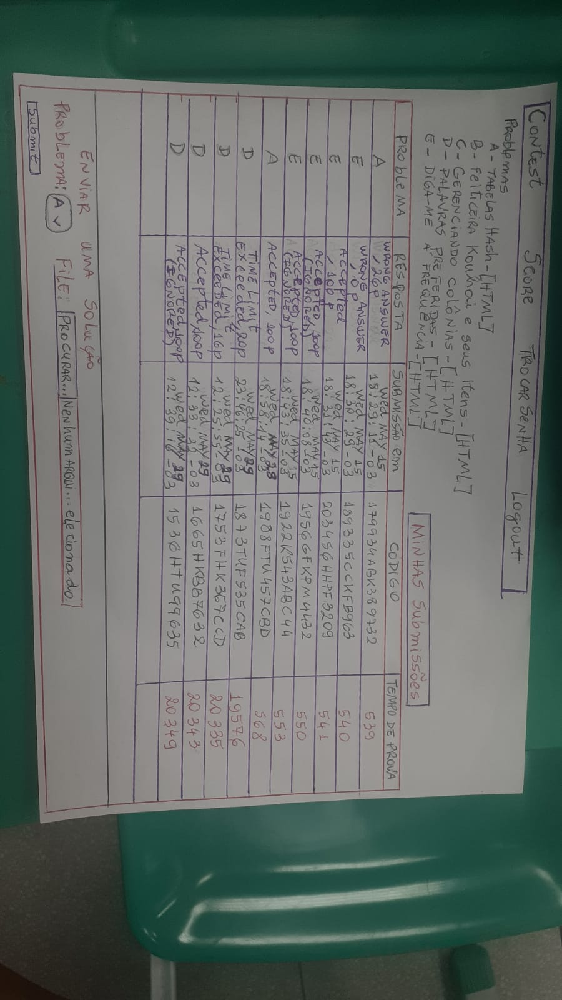
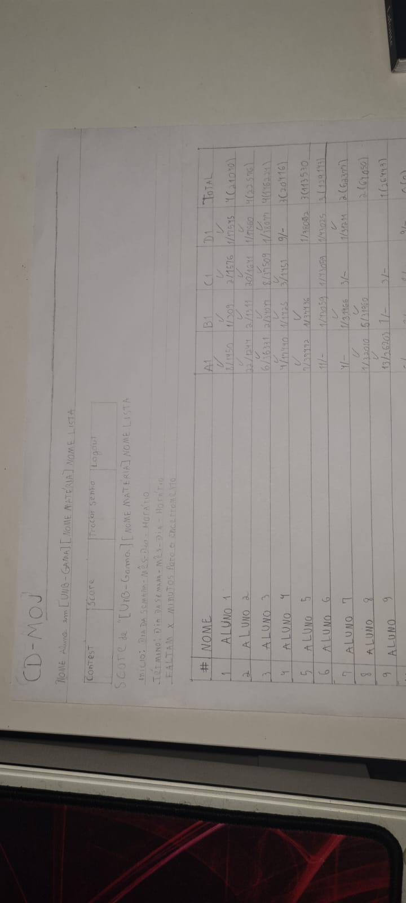
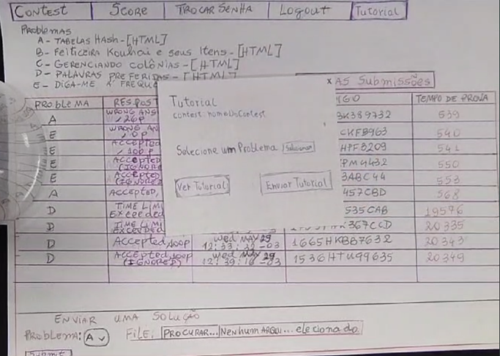
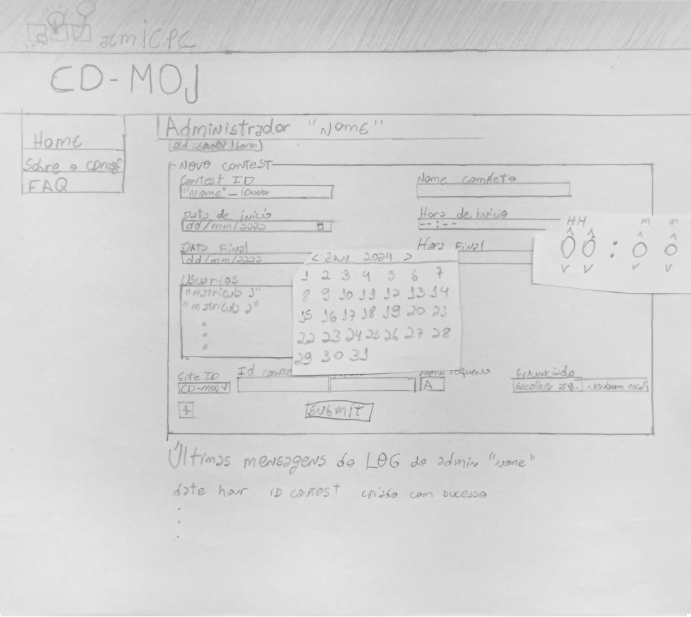
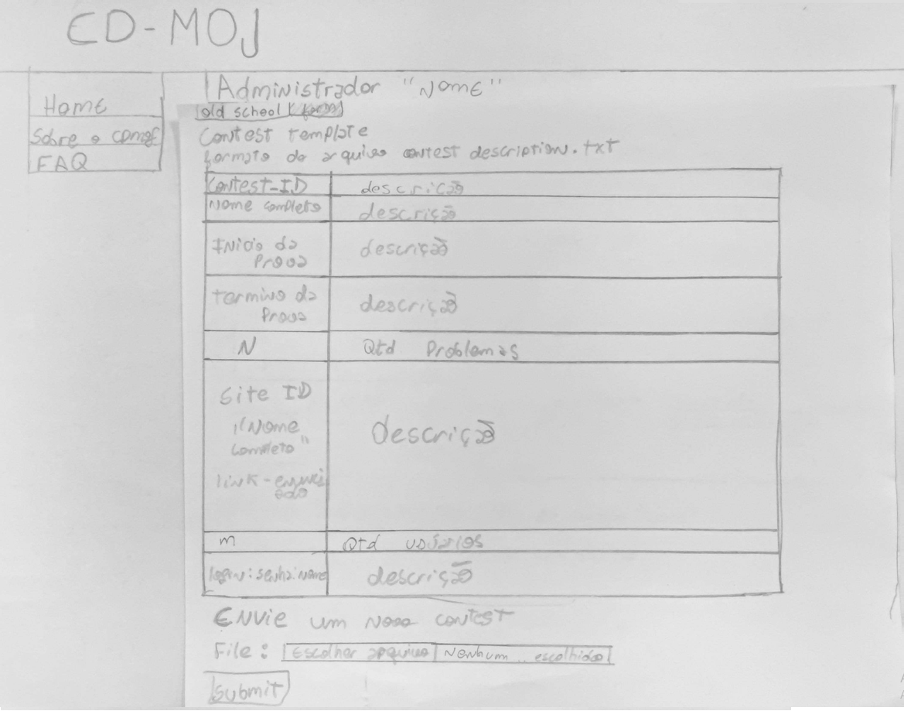

## <a>Introdução</a>

De Acordo com Barbosa e Silva (2021)<a id="anchor_1" href="#REF1">^1^</a>, o relato de resultados da avaliação é utilizado para registrar de maneira sistemática e detalhada as descobertas obtidas durante a avaliação. O documento oferece informações sobre como os usuários interagem com o sistema. Através desse resultado, é possível avaliar a qualidade do uso da solução e identificar problemas na interação e na interface que possam comprometer a experiência do usuário. Este documento apresenta os resultados obtidos durante as avaliações dos Protótipos de Papel.

## <a>Relato - Verificação de Submissão e Ranking de Contest</a>

**Devido as atividades serem pequenas os membros da equipe [João Artur](https://github.com/joao-artl) e [Diego Sousa](https://github.com/DiegoSousaLeite) optaram por realizar a entrevista em conjunto. Abaixo estão os resultados da prototipação**

### <a>Objetivos e Escopo da Avaliação</a>

A avaliação teve como objetivo validar se o Protótipo de Papel Verificação de Submissões e Ranking de Contest está de acordo com o fluxo de atividades do CD-MOJ e identificar áreas de melhoria para fornecer um suporte mais eficaz aos usuários.

### <a>Método de Avaliação Empregado</a>
O método de avaliação foi uma combinação de observação e entrevistas com o usuário, conforme o framework DECIDE<a id="anchor_2" href="#REF2">^2^</a>. Nela foi pedido que o usuário verificasse o fluxo apresentado pelo Protótipo de Papel e após isso ele foi perguntado sobre algumas questões. A tabela 1 apresenta as informações sobre a entrevista e as imagens 1 e 2 apresentam os Protótipos de Papel:

<b>Tabela 1</b> - Cronograma da Entrevista

| Entrevistador(es) | Entrevistado(s) | Horário | Duração  | Data | Local |
| :----------------: | :-------------: | :---------------: | :------------: | :--------: | :----------: |
| [João Artur](https://github.com/joao-artl) e [Diego Sousa](https://github.com/DiegoSousaLeite)| Iago | 10:00 | 5 minutos | 19/06/2023 | FGA |

<b>Fonte:</b> [João Artur](https://github.com/joao-artl) e [Diego Sousa](https://github.com/DiegoSousaLeite)

<b>Imagem 1</b> - Protótipo de Papel Verificação de Submissão

{width: 250px}

<b>Fonte:</b> [João Artur](https://github.com/joao-artl)

<b>Imagem 2</b> - Protótipo de Papel Ranking de Contest

{width: 250px}

<b>Fonte:</b>[Diego Sousa](https://github.com/DiegoSousaLeite)

### <a>Número e Perfil dos Usuários e Avaliadores</a>

O participante se encaixa no [perfil de usuário](https://interacao-humano-computador.github.io/2024.1-CD-MOJ/analise-de-requisitos/perfildeUsuario/), ele é um usuário de entre 18 e 30 anos, estudante de ensino superior e usuário frequente do CD-MOJ.

### <a>Sumário dos Dados Coletados</a>

Durante a entrevista foram coletados dados sobre, a interação do usuário com o sistema, feedbacks sobre o Protótipo de Papel e as respostas das perguntas presentes no [planejamento da avaliação](https://interacao-humano-computador.github.io/2024.1-CD-MOJ/design-avaliacao-desenvolvimento/nivel2/prototipoPapel/planejamentoAvaliacao/#roteiro-de-perguntas).

### <a>Interpretação e Análise dos Dados</a>

A partir da entrevista realizada e da observação do usuário, pode-se concluir que os Protótipos de Papel das tarefas de Verificar Submissões e Ranking de Contest está em conformidade com a realidade e atende às necessidades dos usuários do CD-MOJ. O Usuário sugeriu que todas as informações no site fossem disponibilizadas em português, atualmente o inglês predomina no site.

### <a>Lista dos Problemas Encontrados</a>
O usuário não relatou problemas, porém sugeriu que o site possuisse apenas o português como linguagem e não a junção de termos em diferentes línguas, como ocorre atualmente.

### <a>Planejamento para o Reprojeto do Sistema</a>

As mudanças sugeridas pelo usuário serão adicionadas ao Protótipo de Papel, a alteração será realizada pelo entrevistador conforme o cronograma presente na tabela 2 a seguir:

<figure markdown>
<b>Tabela 2</b> - Correção do Protótipo de Papel.

| Entrevistador | Data | Alteração |
| :----------------: | :-------------: | :---------------: | 
| [João Artur](https://github.com/joao-artl) e  [Diego Sousa](https://github.com/DiegoSousaLeite)| 23/06/2024 | Alterar os termos em inglês para português |

Fonte: [João Artur](https://github.com/joao-artl) e  [Diego Sousa](https://github.com/DiegoSousaLeite).

### <a>Gravação da Entevista</a>

<iframe width="560" height="315" src="https://www.youtube.com/embed/YgvQ_9zKFK0?si=6YbVbOJSe82hguH_" title="YouTube video player" frameborder="0" allow="accelerometer; autoplay; clipboard-write; encrypted-media; gyroscope; picture-in-picture; web-share" referrerpolicy="strict-origin-when-cross-origin" allowfullscreen></iframe>

## <a>Relato - Tutorial de Resolução de Questões Pós-Contest</a>

### <a>Objetivos e Escopo da Avaliação</a>

A avaliação teve como objetivo validar se o Protótipo de Papel Tutorial de Resolução de Questões Pós-Contest está de acordo com o fluxo de atividades do CD-MOJ e identificar áreas de melhoria para fornecer um suporte mais eficaz aos usuários.

### <a>Método de Avaliação Empregado</a>
O método de avaliação foi uma combinação de observação e entrevistas com o usuário, conforme o framework DECIDE<a id="anchor_2" href="#REF2">^2^</a>. Nela foi pedido que o usuário verificasse o fluxo apresentado pelo Protótipo de Papel e após isso ele foi perguntado sobre algumas questões. A tabela 3 apresenta as informações sobre a entrevista e as imagens 3, 4, 5 e 6 apresentam os Protótipos de Papel:

<b>Tabela 3</b> - Cronograma da Entrevista

| Entrevistador(es) | Entrevistado(s) | Horário | Duração  | Data | Local |
| :----------------: | :-------------: | :---------------: | :------------: | :--------: | :----------: |
| [Arthur Alves](https://github.com/arthrok)| Luan Mateus | 16:00 | 5 minutos | 19/06/2023 | ITRAC (LDTEA) - FGA |

<b>Fonte:</b> [Arthur Alves](https://github.com/arthrok)

<b>Imagem 3</b> - Tela inicial do contest

{width: 250px}

<b>Fonte:</b> [Arthur Alves](https://github.com/arthrok)

<b>Imagem 4</b> - Popup de tutorial

{width: 250px}

<b>Fonte:</b> [Arthur Alves](https://github.com/arthrok)

<b>Imagem 5</b> - Selecionar problema

{width: 250px}

<b>Fonte:</b> [Arthur Alves](https://github.com/arthrok)

<b>Imagem 6</b> - Popup com a resolução do problema

{width: 250px}

<b>Fonte:</b> [Arthur Alves](https://github.com/arthrok)

### <a>Número e Perfil dos Usuários e Avaliadores</a>

O participante se encaixa no [perfil de usuário](https://interacao-humano-computador.github.io/2024.1-CD-MOJ/analise-de-requisitos/perfildeUsuario/), ele é um usuário de entre de 21 anos, estudante de ensino superior (cursa Engenharia de Software) e usuário frequente do CD-MOJ.

### <a>Sumário dos Dados Coletados</a>

Durante a entrevista foram coletados dados sobre, a interação do usuário com o sistema, feedbacks sobre o Protótipo de Papel e as respostas das perguntas presentes no [planejamento da avaliação](https://interacao-humano-computador.github.io/2024.1-CD-MOJ/design-avaliacao-desenvolvimento/nivel2/prototipoPapel/planejamentoAvaliacao/#roteiro-de-perguntas).

### <a>Interpretação e Análise dos Dados</a>

A partir da entrevista realizada e da observação do usuário, pode-se concluir que os Protótipos de Papel das tarefas de **Tutorial de Resolução de Questões Pós-Contest** está em conformidade com a realidade e atende às necessidades dos usuários do CD-MOJ. O Usuário sugeriu que todas as informações no site fossem disponibilizadas em português, atualmente o inglês predomina no site.

### <a>Lista dos Problemas Encontrados</a>
O usuário não relatou problemas.

### <a>Planejamento para o Reprojeto do Sistema</a>

Não houve mudanças sugeridas pelo entrevistado.

### <a>Gravação da Entevista</a>

<iframe width="560" height="315" src="https://www.youtube.com/embed/P3l0chrw9W8" title="entrevista protótipo de papel" frameborder="0" allow="accelerometer; autoplay; clipboard-write; encrypted-media; gyroscope; picture-in-picture; web-share" referrerpolicy="strict-origin-when-cross-origin" allowfullscreen></iframe>

## <a>Relato - Submissão de Problemas</a>

### <a>Objetivos e Escopo da Avaliação</a>

A avaliação teve como objetivo validar se o Protótipo de papel relacionado a tarefa de Submissão de Problemas está de acordo com o fluxo de atividades do CD-MOJ e identificar áreas de melhoria para fornecer um suporte mais eficaz aos usuários.

### <a>Método de Avaliação Empregado</a>
O método de avaliação foi uma combinação de observação e entrevistas com o usuário, conforme o framework DECIDE<a id="anchor_2" href="#REF2">^2^</a>. Nela foi pedido que o usuário verificasse o fluxo apresentado pelo Protótipo de Papel e após isso ele foi perguntado sobre algumas questões. A tabela 3 apresenta as informações sobre a entrevista e as imagens 3, 4, 5 e 6 apresentam os Protótipos de Papel:

<b>Tabela 3</b> - Cronograma da Entrevista

| Entrevistador(es) | Entrevistado(s) | Horário | Duração  | Data | Local |
| :----------------: | :-------------: | :---------------: | :------------: | :--------: | :----------: |
| [Eric Silveira](https://github.com/ericbky)| William Bernardo | 16:20 | 5 minutos | 19/06/2023 | ITRAC (LDTEA) - FGA |

<b>Fonte:</b> [Eric Silveira](https://github.com/ericbky)

### <a>Número e Perfil dos Usuários e Avaliadores</a>

O participante se encaixa no [perfil de usuário](https://interacao-humano-computador.github.io/2024.1-CD-MOJ/analise-de-requisitos/perfildeUsuario/), ele é um usuário de 21 anos, estudante de ensino superior (cursa Engenharia de Software) e usuário frequente do CD-MOJ.

### <a>Sumário dos Dados Coletados</a>

Durante a entrevista foram coletados dados sobre, a interação do usuário com o sistema, feedbacks sobre o Protótipo de Papel e as respostas das perguntas presentes no [planejamento da avaliação](https://interacao-humano-computador.github.io/2024.1-CD-MOJ/design-avaliacao-desenvolvimento/nivel2/prototipoPapel/planejamentoAvaliacao/#roteiro-de-perguntas).

### <a>Interpretação e Análise dos Dados</a>

A partir da entrevista realizada e da observação do usuário, pode-se concluir que os Protótipos de Papel das tarefas de **Submissão de Problemas** está em conformidade com a realidade e atende às necessidades dos usuários do CD-MOJ. O usuário relatou que o protótipo de papel está atendendo as expectativas e é de fácil navegabilidade.

### <a>Lista dos Problemas Encontrados</a>
O usuário não relatou problemas, afirmou que o uso é satisfatório.

### <a>Planejamento para o Reprojeto do Sistema</a>

Não houve mudanças sugeridas pelo entrevistado.

### <a>Gravação da Entrevista</a>

<iframe width="560" height="315" src="https://www.youtube.com/embed/7jzpgGZMPpo?si=6l9K6OJcqTJdJPKq" title="YouTube video player" frameborder="0" allow="accelerometer; autoplay; clipboard-write; encrypted-media; gyroscope; picture-in-picture; web-share" referrerpolicy="strict-origin-when-cross-origin" allowfullscreen></iframe>

## <a>Relato - Criação de Contest</a>

### <a>Objetivos e Escopo da Avaliação</a>

A avaliação teve como objetivo validar se o Protótipo de Papel Criação de Contest está de acordo com o fluxo de atividades do CD-MOJ e identificar áreas de melhoria para fornecer um suporte mais eficaz aos usuários.

### <a>Método de Avaliação Empregado</a>
O método de avaliação foi uma combinação de observação e entrevistas com o usuário, conforme o framework DECIDE<a id="anchor_2" href="#REF2">^2^</a>. Nela foi pedido que o usuário verificasse o fluxo apresentado pelo Protótipo de Papel e após isso ele foi perguntado sobre algumas questões. A tabela 4 apresenta as informações sobre a entrevista e as imagens 7, 8 e 9 apresentam os Protótipos de Papel:

<b>Tabela 4</b> - Cronograma da Entrevista

| Entrevistador(es) | Entrevistado(s) | Horário | Duração  | Data | Local |
| :----------------: | :-------------: | :---------------: | :------------: | :--------: | :----------: |
| [Douglas Marinho](https://github.com/M4RINH0)| Felipe Motta | 09:50 | 5 minutos | 19/06/2023 | ITRAC (Contâiner) - FGA |

<b>Fonte:</b> [Douglas Marinho](https://github.com/M4RINH0)

<b>Imagem 7</b> - Formulário em site

{width: 250px}

<b>Fonte:</b> [Douglas Marinho](https://github.com/M4RINH0)

<b>Imagem 8</b> - PopUps abertos

{width: 250px}

<b>Fonte:</b> [Douglas Marinho](https://github.com/M4RINH0)

<b>Imagem 9</b> - Template para .txt

{width: 250px}

<b>Fonte:</b> [Douglas Marinho](https://github.com/M4RINH0)

### <a>Número e Perfil dos Usuários e Avaliadores</a>

O participante se encaixa no [perfil de usuário](https://interacao-humano-computador.github.io/2024.1-CD-MOJ/analise-de-requisitos/perfildeUsuario/), ele é um usuário de entre de 21 anos, estudante de ensino superior (cursa Engenharia de Software) e usuário frequente do CD-MOJ.

### <a>Sumário dos Dados Coletados</a>

Durante a entrevista foram coletados dados sobre, a interação do usuário com o sistema, feedbacks sobre o Protótipo de Papel e as respostas das perguntas presentes no [planejamento da avaliação](https://interacao-humano-computador.github.io/2024.1-CD-MOJ/design-avaliacao-desenvolvimento/nivel2/prototipoPapel/planejamentoAvaliacao/#roteiro-de-perguntas).

### <a>Interpretação e Análise dos Dados</a>

A partir da entrevista realizada e da observação do usuário, pode-se concluir que os Protótipos de Papel das tarefas de **Criação de Contest** está em conformidade com a realidade e atende às necessidades dos usuários do CD-MOJ. O Usuário sugeriu que todas as informações no site fossem disponibilizadas em português, atualmente o inglês predomina no site.

### <a>Lista dos Problemas Encontrados</a>
O usuário não relatou problemas.

### <a>Planejamento para o Reprojeto do Sistema</a>

Não houve mudanças sugeridas pelo entrevistado.

### <a>Gravação da Entevista</a>

<iframe width="560" height="315" src="https://www.youtube.com/embed/3rk_C3nB-Jo" title="Avaliação do protótipo de papel (Criação de Contest) IHC - Grupo 01" frameborder="0" allow="accelerometer; autoplay; clipboard-write; encrypted-media; gyroscope; picture-in-picture; web-share" referrerpolicy="strict-origin-when-cross-origin" allowfullscreen></iframe>

## <a>Referências Bibliográficas</a>

> <a id="REF1" href="#anchor_1">1.</a> Barbosa, S. D. J.; Silva, B. S. da; Silveira, M. S.; Gasparini, I.; Darin, T.; Barbosa, G. D. J. (2021) *Interação Humano-Computador e Experiência do usuário.* Capítulo 11 Planejamento da Avaliação de IHC, tópico 11.7.5 Consolidação e Relato dos Resultados, página 279 . Autopublicação. ISBN: 978-65-00-19677-1.

> <a id="REF2" href="#anchor_2">2.</a> Barbosa, S. D. J.; Silva, B. S. da; Silveira, M. S.; Gasparini, I.; Darin, T.; Barbosa, G. D. J. (2021) *Interação Humano-Computador e Experiência do usuário.* Capítulo 11 Planejamento da Avaliação de IHC, tópico 11.8 O Framework DECIDE, página 279 e 280. Autopublicação. ISBN: 978-65-00-19677-1.

## <a>Histórico de Versão</a>

| Versão | Data | Data Prevista de Revisão | Descrição  | Autor(es)  | Revisor(es) |
| ------- | ------ | ------ | ------- | -------- | -------- |
| `1.0` | 19/06/2024 | 19/06/2024 | Criação do documento, introdução e relato do protótipo de papel de verificação de submissões e ranking de Contest| [João Artur](https://github.com/joao-artl) | [Eric Silveira](https://github.com/ericbky) |
| `1.1` | 19/06/2024 | 19/06/2024 | Relato de Tutorial de Resolução de Questões Pós-Contest  | [Arthur Alves](https://github.com/arthrok) | [Eric Silveira](https://github.com/ericbky) |
| `1.2` | 19/06/2024 | 19/06/2024 | Relato de Criação de Contest  | [Douglas Marinho](https://github.com/M4RINH0) | [Eric Silveira](https://github.com/ericbky) |