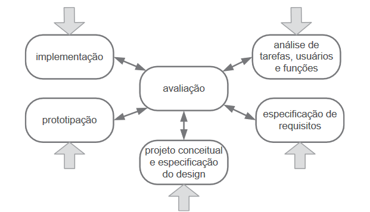

# Processos de Design

## <a>Introdução</a>

Antes de adentrarmos no processo de design, é fundamental compreender o que design representa. Segundo Barbosa e Silva (2021, p.107)<a id="anchor_1" href="#REF1">1</a>, design é um processo composto por três atividades primordiais: análise da situação atual (identificação de um problema), síntese de uma intervenção e avaliação da nova situação (da intervenção).

 Os processos de design, portanto, são métodos que permitem a execução dessas atividades de maneira sistemática e iterativa, visando desenvolver soluções que atendam às demanda dos usuários. Dentre as várias técnicas disponíveis, destacam-se quatro principais: ciclo de vida simples, ciclo de vida em estrela, engenharia de usabilidade de Nielsen e engenharia de usabilidade de Mayhew.
 
## <a>Modelo de Design</a>

É importante ressaltar que o modelo de design adotado pelo grupo foi o Ciclo de Vida de Mayhew. No entanto, neste documento serão explorados os quatro principais processos de design, discutindo como podem ser aplicados para propor intervenções eficazes na resolução de problemas, bem como a motivação por trás da escolha do grupo para o projeto.

## <a>Projeto de Design</a>

O projeto de Design de Interação Humano-Computador aborda três atividades básicas: análise, síntese e avaliação. A análise visa estudar e interpretar uma situação, planejando e executando intervenções, cujos efeitos são verificados durante a etapa de síntese, e posteriormente avaliados. Uma intervenção representa uma solução para um problema identificado e pode ser avaliada em todas as suas etapas, desde a concepção até após a implementação.

 

A organização dessas atividades básicas pode variar, e os processos de design em IHC propõem a execução iterativa, permitindo o refinamento progressivo das intervenções propostas e da análise da situação atual. Esses processos são centrados no usuário, seguindo os princípios de foco no usuário, métricas observáveis e design interativo.

 

Para atender ao princípio do foco no usuário, é essencial que o designer estude o perfil dos usuários do sistema. O processo deve permitir a realização de experimentos para coletar dados sobre a performance e as reações dos usuários ao utilizar o sistema. Além disso, as etapas do processo de design podem ser repetidas conforme surgem novas necessidades, garantindo a adaptabilidade e a eficácia das soluções propostas.

## <a>Modelos</a>

### <a>Ciclo de Vida Simples</a>

Proposto por Preece, Sharp e Rogers. Esse modelo se concentra em quatro atividades: análise, design, implementação e avaliação. Conforme a imagem a seguir:

<figure markdown>

<b>Figura 1</b> - Atividades do Modelo de Ciclo de Vida Simples.

{width: 300}
<figcaption>Fonte: BARBOSA e SILVA, 2021, p.114.</figcaption>
</figure>

O Ciclo de Vida Simples  consiste em quatro fases principais: análise, design, implementação e avaliação. Na fase de análise, são identificadas as necessidades e características dos usuários, juntamente com os requisitos do sistema. Em seguida, na fase de design, são criadas soluções de interface com base nessas informações, priorizando usabilidade e experiência do usuário. Posteriormente, na fase de implementação, o design é transformado em um sistema funcional. Por fim, na fase de avaliação, o sistema é testado e refinado com base no feedback dos usuários, podendo retornar às fases anteriores para ajustes.(BARBOSA e SILVA, 2021, p.114).

### <a>Ciclo de Vida em Estrela</a>

O Ciclo de Vida em Estrela foi desenvolvido por Hix e Hartson no início da década de 1990 (Hix e Hartson,1993), ele é composto por seis atividades conforme a figura a seguir:

<figure markdown>

<b>Figura 2</b> - Atividades do Modelo de Ciclo de Vida em Estrela.

{width: 300}
<figcaption>Fonte: BARBOSA e SILVA, 2021, p.115.</figcaption>
</figure>

Nesse modelo, o designer tem a responsabilidade de determinar a ordem das atividades, mas a avaliação é obrigatória após cada uma, independentemente da sequência escolhida. As atividades desempenham um papel crucial, pois são responsáveis por garantir que os dados coletados e os requisitos especificados atendam às necessidades do usuário. Além disso, as atividades são utilizadas para identificar problemas de usabilidade nos designs, protótipos e no sistema final.

### <a>Engenharia de Usabilidade de Nielsen</a>

Segundo Jakob Nielsen, engenharia de usabilidade é um conjunto de atividades que devem acontecer durante todo o ciclo de vida do produto (BARBOSA e SILVA, 2021, p.116). A tabela 1 mostra as atividades definidas por Nielsen em seu ciclo de vida:

<figure style="text-align: center;">
    
<b>Tabela 1</b> - Atividades da Engenharia de Usabilidade de Nielsen.

    <table style="margin: 0 auto; text-align: left;">
        <tr>
            <th>1. Conheça seu usuário</th>
            <th>6. Faça o design coordenado da interface como um todo</th>
        </tr>
        <tr>
            <th>2. Realize uma análise competitiva</th>
            <th>7. Aplique diretrizes e análise heurística</th>
        </tr>
        <tr>
            <th>3. Defina as metas de usabilidade</th>
            <th>8. Faça protótipos</th>
        </tr>
        <tr>
            <th>4. Faça designs paralelos</th>
            <th>9. Realize testes empíricos</th>
        </tr>
        <tr>
            <th>5. Adote o design participativo</th>
            <th>10. Pratique design iterativo</th>
        </tr>
    </table>
    <figcaption>Fonte: BARBOSA e SILVA, 2021, p.116.</figcaption>
</figure>

### <a>Engenharia de Usabilidade de Mayhew</a>

Deborah Mayhew propôs esse modelo iterativo para a engenharia de usabilidade dividido em três etapas: análise de requisitos, design/avaliação/desenvolvimento e instalação. Na imagem a seguir é possível verificar o modelo proposto:

<figure markdown>

<b>Figura 3</b> - Atividades do Modelo de Ciclo de Vida de Mayhew.

{width: 300}
<figcaption>Fonte: BARBOSA e SILVA, 2021, p.119.</figcaption>
</figure>

Abaixo a definição de cada uma das etapas:

#### <a>Análise de Requisitos</a>

Nesta fase, as metas de usabilidade são estabelecidas, levando em conta o perfil dos usuários, a análise das tarefas a serem executadas e as características da plataforma onde o sistema será utilizado, juntamente com os princípios de design de Interação Humano-Computador (IHC). Para assegurar a aplicação eficaz dessas metas ao longo do desenvolvimento, é comum consolidá-las em guias de estilo que abrangem diversos elementos da interface do usuário, como disposição, cores, tipografia, imagens, ícones e sons, fornecendo diretrizes claras e concisas para orientar o processo de design e desenvolvimento

#### <a>Design, avaliação, desenvolvimento</a>

Nesta etapa, a interface é desenvolvida para atender às metas de usabilidade estabelecidas anteriormente, seguindo um processo em três níveis de detalhamento. O designer começa com protótipos de baixa fidelidade para reimaginar as tarefas, avança para protótipos de média fidelidade estabelecendo padrões de design, e finaliza com projetos de alta fidelidade para implementação.

#### <a>Instalação</a>

Nesta etapa, o processo inclui a obtenção de feedback dos usuários que utilizaram o sistema por um período, visando aprimorar futuras versões do sistema ou identificar a necessidade de desenvolver novos sistemas.

## <a>Motivações para escolha</a>

Após análise dos modelos discutidos, o grupo concluiu que o Ciclo de Vida de Mayhew seria o melhor para o projeto. Suas etapas detalhadas e bem definidas minimizam a subjetividade, o que é crucial dada a inexperiência do grupo em IHC. Um modelo robusto e detalhado serve como guia confiável para nossa situação.

Considerando que o sistema já está em produção começaremos com a etapa de instalação do Ciclo de Vida de Mayhew. Aqui, identificaremos alguns problemas existentes no sistema, bem como suas possíveis melhorias. Em seguida, avançaremos para a fase de análise de requisitos, seguindo o fluxo previsto no modelo.

## <a>Bibliografia</a>
> <a id="REF1" href="#anchor_1">1.</a>Barbosa, S. D. J.; Silva, B. S. da; Silveira, M. S.; Gasparini, I.; Darin, T.; Barbosa, G. D. J. (2021)Interação Humano-Computador e Experiência do usuário.

## <a>Histórico de Versão</a>

| Versão| Data | Data Prevista de Revisão| Descrição  | Autor(es)  | Revisor(es) |
| ------- | ------ | ------ | ------- | -------- | -------- |
| `1.0` | 20/03/2024 | 21/03/2024 | Criação do documento. | [João Artur](https://github.com/joao-artl) e [Luiz Gustavo](https://github.com/LuizGust4vo) | [Arthur Alves](https://github.com/Arthrok) e [Eric Silveira](https://github.com/ericbky) |
